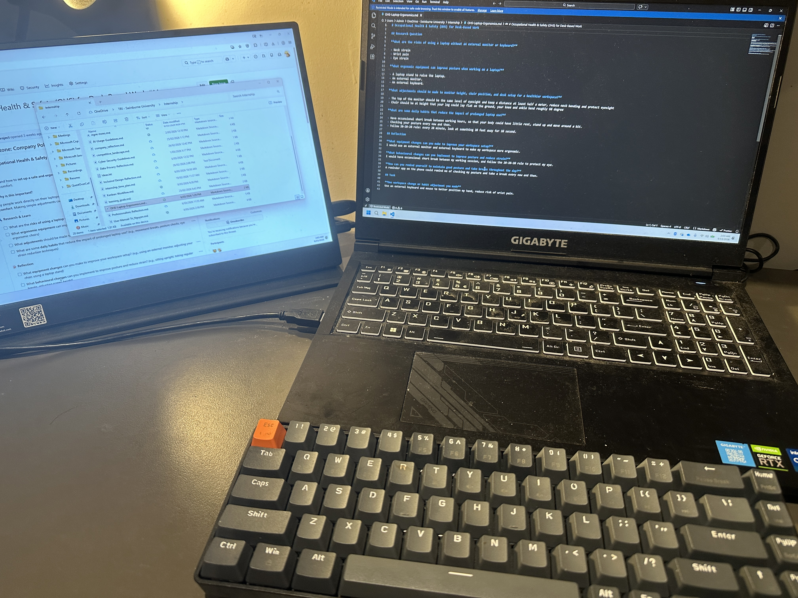

# Occupational Health & Safety (OHS) for Desk-Based Work

## Research Question

**What are the risks of using a laptop without an external monitor or keyboard?**

- Neck strain
- Wrist pain
- Eye strain

**What ergonomic equipment can improve posture when working on a laptop?**

- A laptop stand to raise the laptop.
- An external monitor.
- An external keyboard.

**What adjustments should be made to monitor height, chair position, and desk setup for a healthier workspace?**

- The top of the monitor should be the same level of eyesight and keep a distance at least half a meter, reduce neck bending and protect eyesight
- Chair should be at height that your leg could lay flat on the ground, your knee and ankle bend roughly 90 degree

**What are some daily habits that reduce the impact of prolonged laptop use?**

- Have occansional short break between working hours, so that your body could have little rest, stand up and move around a bit.
- Checking your posture every now and then.
- Follow 20-20-20 rule: every 20 minute, look at something 20 feet away for 20 second.

## Reflection

**What equipment changes can you make to improve your workspace setup?**
I would use an external monitor and external keyboard to make my workspace more ergonomic.

**What behavioural changes can you implement to improve posture and reduce strain?**
I would have occansional short break between my working session, and follow the 20-20-20 rule to protect my eye.

**How can you remind yourself to maintain good posture and take breaks throughout the day?**
A reminder app on the phone could remind me of checking my posture and take a break every now and then. I simply use my phone timer app; I set up a 20 minutes timer and start to work. When it end, I take my short break for my eye, and do a bit of stretching on the chair. Then I just restart the timer and the cycle goes on.

## Task

**One workspace change or habit adjustment you made**
Use an external keyboard and mouse to better position my hand, reduce risk of wrist pain.

