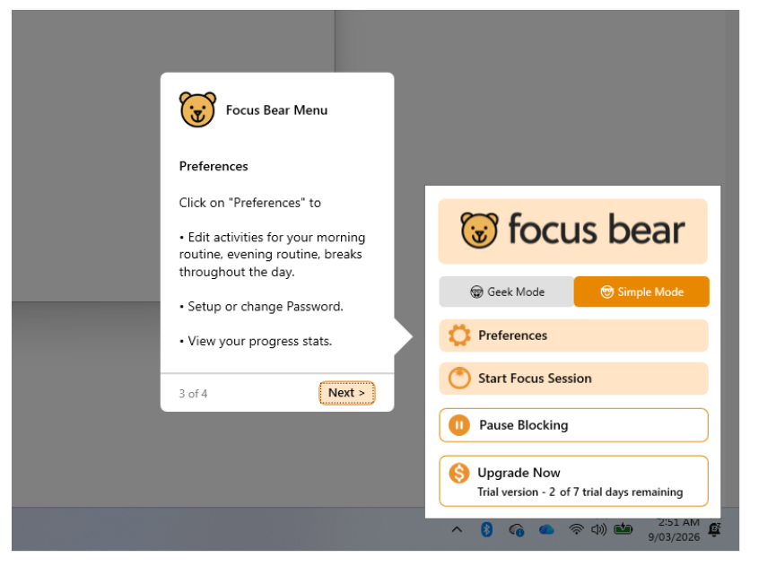
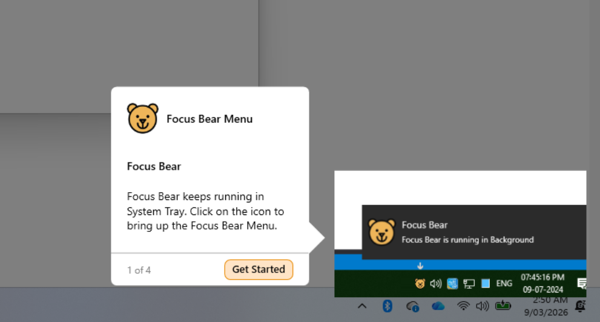
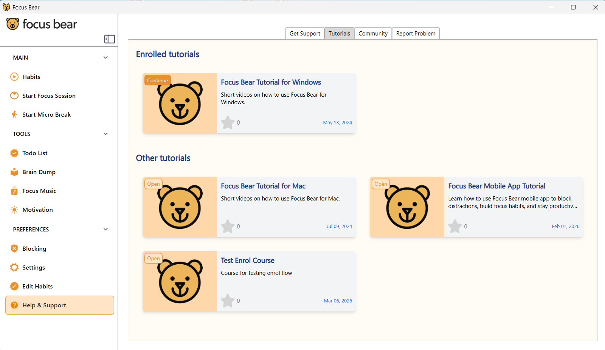
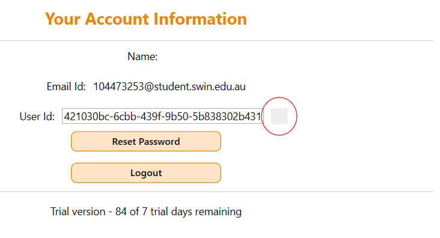
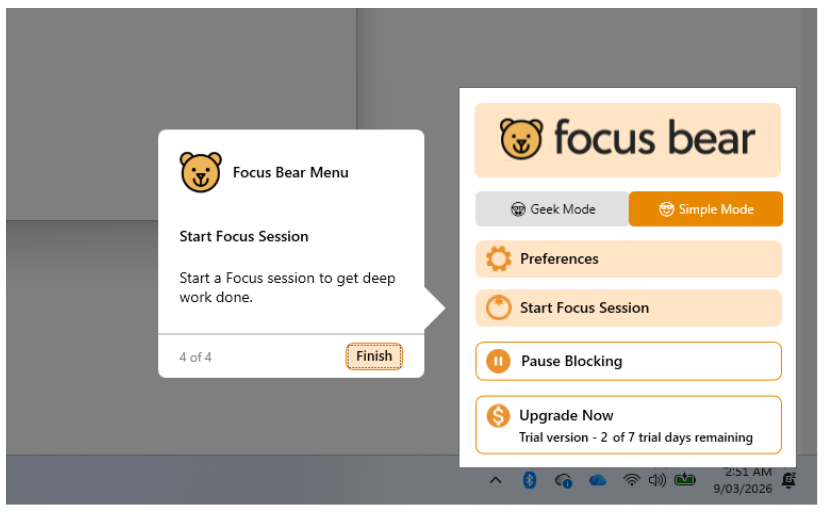

# First-Time User Experience

## First Time Experience

The app have an onboarding session to introduce to new user about the app and how to start focus session, which is the main feature of the app. However, the onboarding does have some lacking in showing other functionalities of the app and some small UI confusion.

1. One of the other important feature of Focus Bear is building habit. However, throughout the onboarding process, this feature only briefly mention but not actually being show to user how to set up and use.

2. This is a very small detail but it could be a bit confuse for few people. The onboarding process did mention that Focus Bear will keep running in the System Tray. However, depend on the version of OS the user using, icon for Focus Bear may or may not just showing in the task bar like display in the image, but could be bundle into the collapse System Tray menu, and need to click on an arrow to see it. Some people you is not very good with tech or Windows may be confused if their task bar look different from the image and not having the Focus Bear icon.

3. The onboarding is a quick tutorial to introduce the app. After complete the first time, if the user miss something and want to go through it again, they can't as there is no option in the app to do so. There is no quick tutorial button in the app, there are only videos.

4. There is a small UI confusion in the app. In the account tab, there is a small button used for copy the user ID, but the button itself is very unclear. There isn't any text or image on the button to indicate it functionality. Only when hover over it that it tell the button is to copy ID.

5. Focus Bear have the ability to be turn off (permanently or temporary) with the "Pause Blocking" button in the UI menu. However, throughout the onboarding, this function is not mention anywhere. It is not like someone who use Focus Bear should turn it off, but because if someone have some buisiness and really need to pause Focus Bear, there is no obvious option for that, especially with someone who is not good with tech or not try to tingling around and press all the button of the app.

## Improvement could be made

- User should have the option to revisit the onboarding process again, as the user could only go through the quick tutorial once, if later they want to quickly go through the tutorial again, there are curently no option for that beside watching video. So a new "Onboarding" button could be added.
- A UI improvement could be made in the account tab of Setting. When try to copy the ID, there is a button used for this, but there were no text or image to indicate this. A label of "Copy ID" or a symbol could be place near or on the button so that it easier to spot the button, instead of a blank square.
